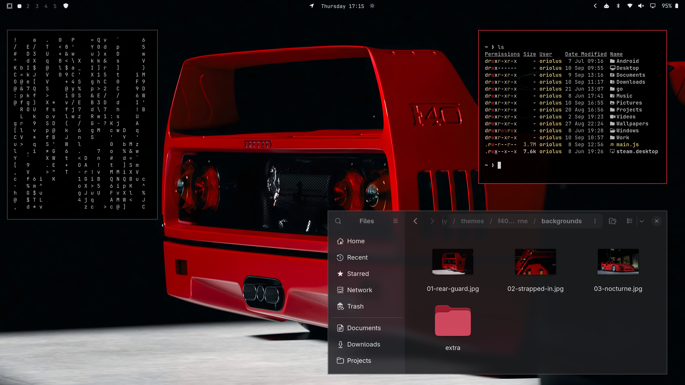
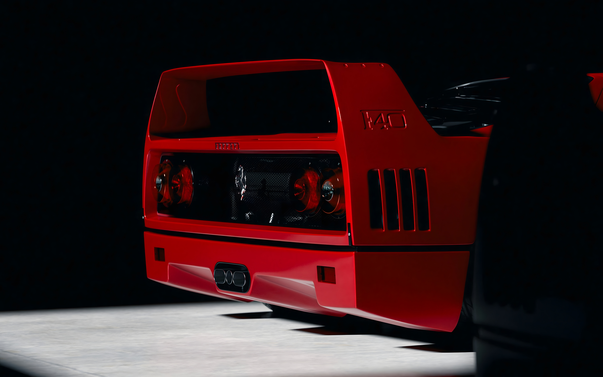
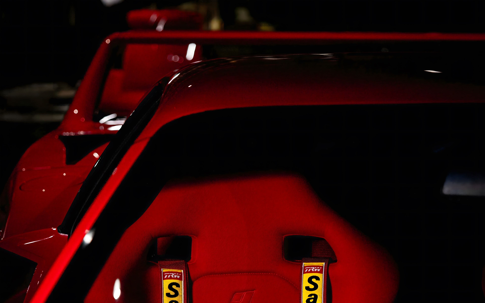
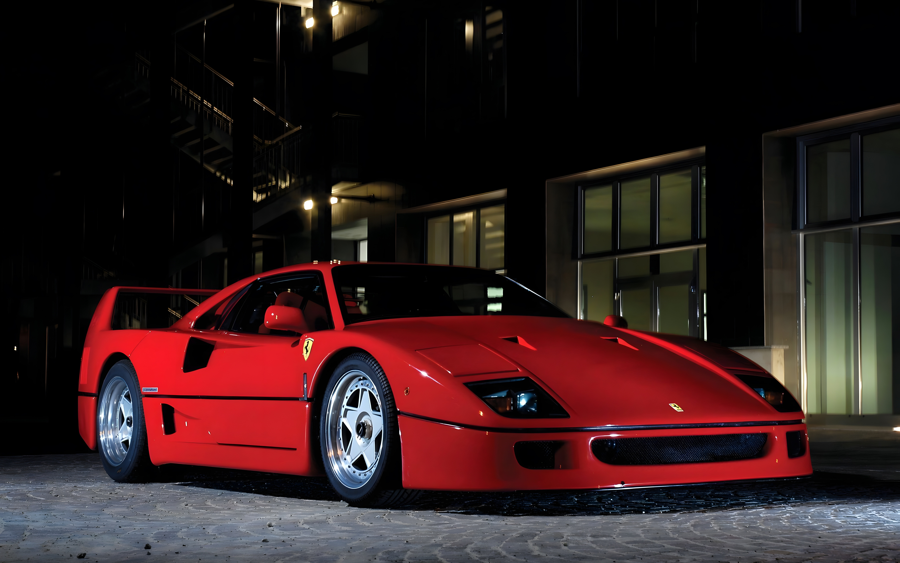

# F40 Nocturne

An **Omarchy** theme inspired by the **Ferrari F40**, the last machine **Enzo Ferrari** put his name on.

Every colour is taken from the car. **Rosso Corsa** from the bodywork, **Giallo** from the **Cavallino** badge, and silver from the **Speedline** wheels and other bare-metal details.



## Install

```bash
omarchy theme install https://github.com/oriolescserr/omarchy-f40-nocturne
omarchy theme set f40-nocturne
```

Or **Install → Style → Theme** from the Omarchy menu (`Super + Space`) and
paste the URL.

## Backgrounds

Images are free of copyright, cropped to fit and upscaled to **3840×2400**. Cycle with `omarchy theme bg next`, or from the Omarchy menu (`Super + Space`) under **Style → Background**.

<table>
  <tr>
    <td align="center" width="33%">
      <br>
      <sub><strong>01 - Rear Guard</strong> (default)<br>Photo by yokatan</sub>
    </td>
    <td align="center" width="33%">
      <br>
      <sub><strong>02 - Strapped In</strong><br>Photo by Stefano Romanello</sub>
    </td>
    <td align="center" width="33%">
      <br>
      <sub><strong>03 - Nocturne</strong><br>Photo credit not found</sub>
    </td>
  </tr>
</table>
